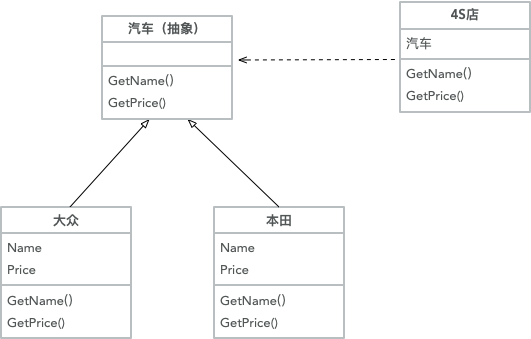

## 面向对象的设计原则

设计原则是2002年 罗伯特·塞西尔·马丁 (Robert Cecil Martin)俗称“鲍伯叔叔” [敏捷软件开发：原则、模式与实践/软件工程实践丛书](https://item.jd.com/12468135.html)书中提到可重用的五大设计原则 - “SOLID”（英文首字母缩略字）:

- Single Responsibility Principle - 单一职责
- Open / Closed Principle - 开闭原则
- Liskov Substitution Principle - 里氏替换原则
- Interface Segregation Principle - 接口隔离原则
- Dependency Inversion Principle - 依赖倒置原则

### 一、单一职责原则
该原则提出对象不应该承担太多职责，如果一个对象承担了太多的职责，至少存在以下两个缺点：
- 一个职责的变化可能会削弱或者抑制这个类实现其他职责的能力；
- 当客户端需要该对象的某一个职责时，不得不将其他不需要的职责全都包含进来，从而造成冗余代码或代码的浪费。

单一职责的核心就是控制类的粒度大小、将对象解耦、提高其内聚性

#### 1、单一职责的优点
- 降低类的复杂度。一个类只负责一项职责，其逻辑肯定要比负责多项职责简单得多。
- 提高类的可读性。复杂性降低，自然其可读性会提高。
- 提高系统的可维护性。可读性提高，那自然更容易维护了。
- 变更引起的风险降低。变更是必然的，如果单一职责原则遵守得好，当修改一个功能时，可以显著降低对其他功能的影响。

#### 2、单一职责原则的实现方法
单一职责原则是最简单但又最难运用的原则，需要设计人员发现类的不同职责并将其分离，再封装到不同的类或模块中。而发现类的多重职责需要设计人员具有较强的分析设计能力和相关重构经验。

### 二、开闭原则
开闭原则（OCP）即对修改关闭，扩展开放。代码模块应该在修改代码的的情况下，进行代码的扩展。一般需要通过接口和抽象实现该效果。
开闭原则的含义是当应用的需求改变时，在不修改软件实体代码的源代码或二进制代码的前提下，可以扩展模块功能以满足需求。

#### 1、开闭原则的作用

开闭原则是面向对象设计的终极目标，它使软件设计有一定的适应性和灵活性。其作用如下：
- 对软件测试的影响

    遵守原则的情况下，测试可以只对扩展代码进行测试

- 可以提高代码的可复用性

    遵守原则，粒度越小，被复用的可能性越大

- 可以提高软件的可维护性

    遵守原则，其稳定性高，持续性强，从而易于维护和扩展

#### 2、开闭原则的实现方法
可以通过“抽象约束、封装变化”来实现开闭原则，即通过接口或者抽象类为软件实体定义一个相对稳定的抽象层，而将相同的可变因素封装在相同的具体实现类中

因为抽象灵活性好，适应性广，只要抽象的合理，可以基本保持软件架构的稳定。而软件中易变的细节可以从抽象派生来的实现类来进行扩展，当软件需要发生变化时，只需要根据需求重新派生一个实现类来扩展就可以了。

下面以 汽车和4S店为例介绍开闭原则的应用。
分析：4s店销售各种型号品牌的汽车，汽车的价格、型号不一样。这些汽车有共同的属性，抽象出一个汽车分类。4s店进一个新型号的汽车，实现这个抽象类就可以，不影响其他型号。如下图所示

### 三、里氏替换原则

### 四、接口隔离原则

### 五、依赖倒置原则

### ChangeLog
- 2020年7月22日 完成单一职责和开闭原则